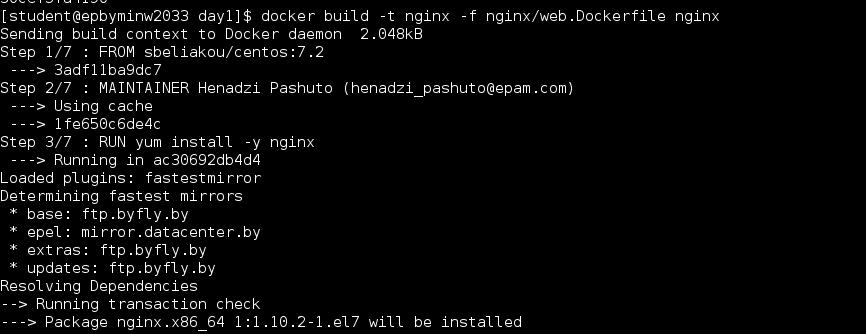
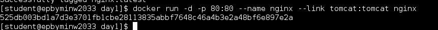
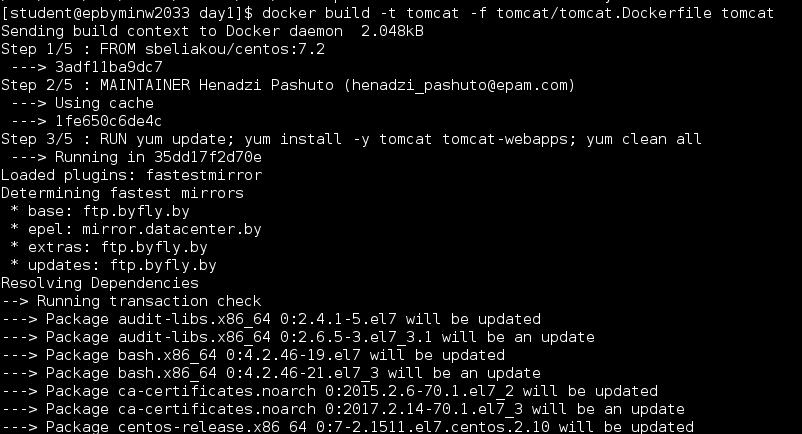
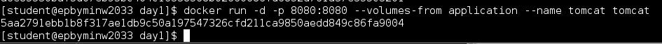
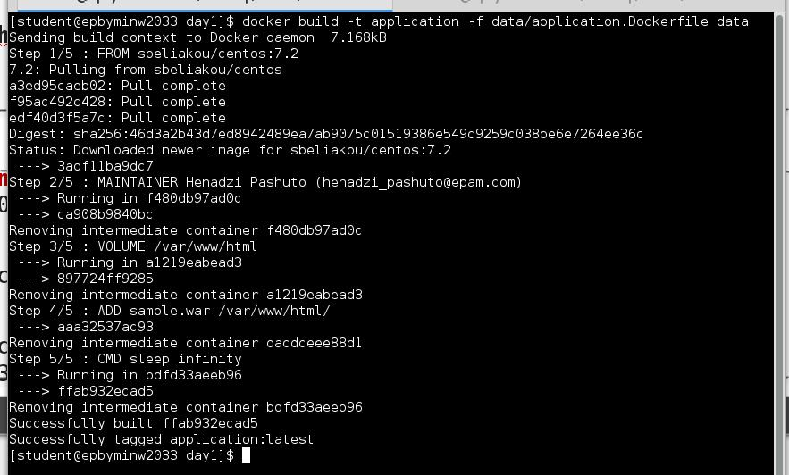
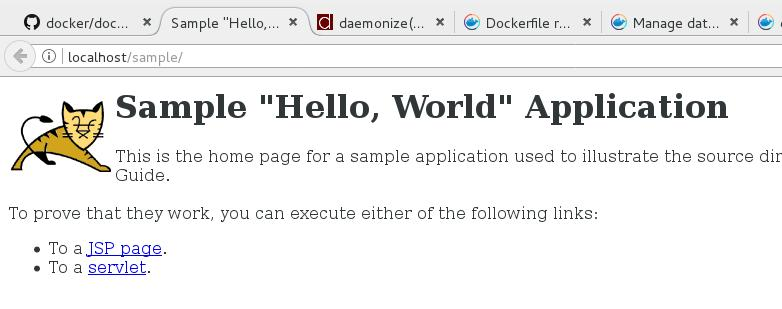
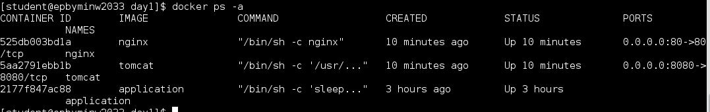
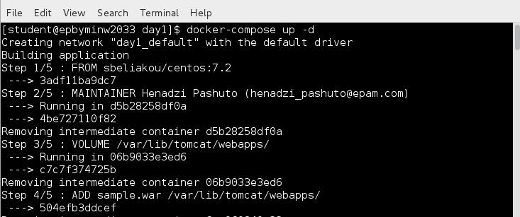
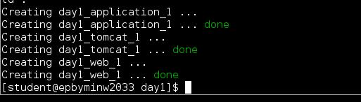

MTN.*NIX.11 Automated Environment Configuration Management
---

***Student***: Henadzi_Pashuto

Home Task
---

Using base docker image ***sbeliakou/centos:7.2***

1. Wiht ```Dockerfiles```:
    - Create Docker Image of ```nginx``` ([web.Dockerfile](/web.Dockerfile))
    - Create Docker Image of ```Tomcat 7``` ([tomcat.Dockerfile](/tomcat.Dockerfile))
    - Create Docker Image (Data Volume) with [```hello world```](https://tomcat.apache.org/tomcat-7.0-doc/appdev/sample/sample.war) application for Tomcat ([application.Dockerfile](application.Dockerfile))    
    - Run these Images so that [http://localhost/sample](http://localhost/sample) shows ```hello world``` page    
    - ```Nginx``` container forwards http requests to ```Tomcat``` container; Only ```nginx``` container exposes port (80)    
2. With ```docker-compose```:
    - Create ```docker-compose.yml``` file to build containers from previos task
    - Run "environment" in daemon mode    
3. Create own branch (epam login without @epam.com, in lowercase)
4. Create PR with description of reported task
6. All needed resources (if they are) must be placed into ```/resources``` folder

Task Report Notes
---
1. Wiht ```Dockerfiles```:
    - Create Docker Image of ```nginx``` ([web.Dockerfile](/web.Dockerfile))
    [a link](https://github.com/aion3181/docker/blob/henadzi_pashuto/docker-1/resources/nginx/web.Dockerfile)
    
    
    
    - Create Docker Image of ```Tomcat 7``` ([tomcat.Dockerfile](/tomcat.Dockerfile))
    [a link](https://github.com/aion3181/docker/blob/henadzi_pashuto/docker-1/resources/tomcat/tomcat.Dockerfile)
    
    
    
    - Create Docker Image (Data Volume) with [```hello world```](https://tomcat.apache.org/tomcat-7.0-doc/appdev/sample/sample.war) application for Tomcat ([application.Dockerfile](application.Dockerfile))
    [a link](https://github.com/aion3181/docker/blob/henadzi_pashuto/docker-1/resources/data/application.Dockerfile)    
    
    
    - Run these Images so that [http://localhost/sample](http://localhost/sample) shows ```hello world``` page
    
    
    - ```Nginx``` container forwards http requests to ```Tomcat``` container; Only ```nginx``` container exposes port (80)
    
    
2. With ```docker-compose```:
    - Create ```docker-compose.yml``` file to build containers from previos task
    [a link](https://github.com/aion3181/docker/blob/henadzi_pashuto/docker-1/docker-compose.yml)
    - Run "environment" in daemon mode
    
    
