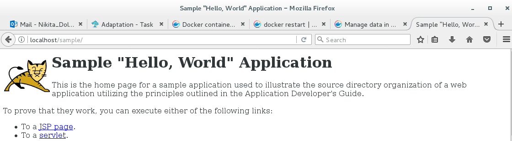
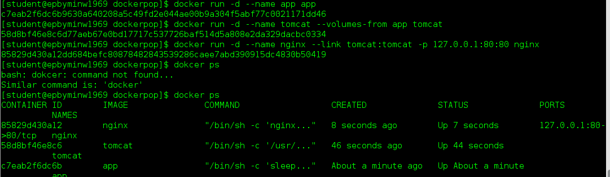

MTN.*NIX.11 Automated Environment Configuration Management
---

***Student***: Andrei Konchyts

Home Task
---

Using base docker image ***sbeliakou/centos:7.2***

1. Wiht ```Dockerfiles```:
    - Create Docker Image of ```nginx``` ([web.Dockerfile](web.Dockerfile))
    - Create Docker Image of ```Tomcat 7``` ([tomcat.Dockerfile](tomcat.Dockerfile))
    - Create Docker Image (Data Volume) with [```hello world```](https://tomcat.apache.org/tomcat-7.0-doc/appdev/sample/sample.war) application for Tomcat ([application.Dockerfile](application.Dockerfile))
    - Run these Images so that [http://localhost/sample](http://localhost/sample) shows ```hello world``` page
    - ```Nginx``` container forwards http requests to ```Tomcat``` container; Only ```nginx``` container exposes port (80)
2. With ```docker-compose```:
    - Create ```docker-compose.yml``` file to build containers from previos task
    - Run "environment" in daemon mode
3. Create own branch (epam login without @epam.com, in lowercase)
4. Create PR with description of reported task
6. All needed resources (if they are) must be placed into ```/resources``` folder

Task Report Notes
---
### **1.** With Dockerfiles:   
   * Building Docker Image of ```nginx``` ([web.Dockerfile](web.Dockerfile)):  
   *$ docker build -t nginx -f web.Dockerfile .*   
	  
   
   * Building Docker Image of ```Tomcat 7``` ([tomcat.Dockerfile](tomcat.Dockerfile)):  
   *$ docker build -t tomcat -f tomcat.Dockerfile .*   
	  
   
   * Building Docker Image of ```application``` for Tomcat ([application.Dockerfile](application.Dockerfile)):  
   *$ docker build -t app -f application.Dockerfile .*   
	  

   * Running these images:  
   *$ docker run -d --name myapp app*   
   *$ docker run -d --volumes-from myapp --name mytomcat tomcat*   
   *$ docker run --name mynginx --link mytomcat:tomcat -d -p 80:80 nginx*   
     
   
   * Check the result:  
     
	
### **2.** With docker-compose ([docker-compose.yml](docker-compose.yml)):  
  
   * Build containers from previos task:  
   *$ docker-compose up -d*  
     
   
     
   
   * Check the result:  
     

