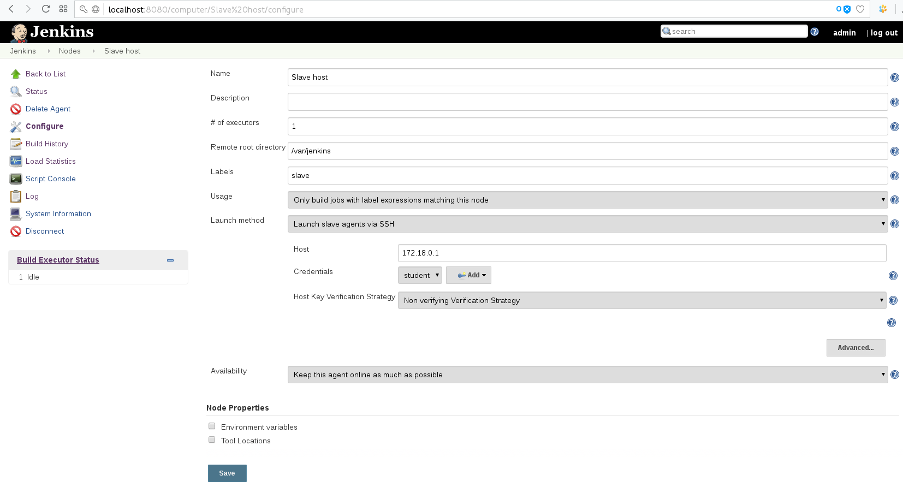
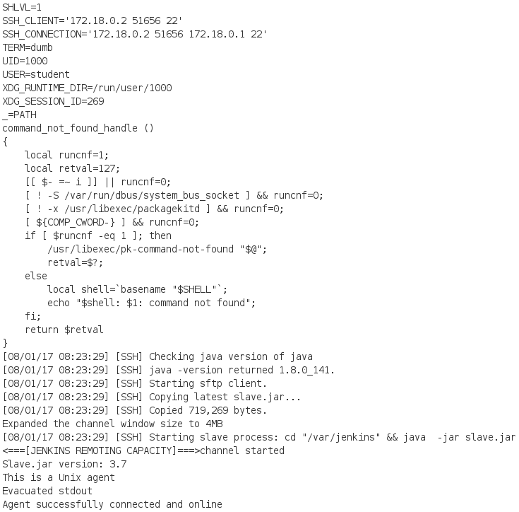
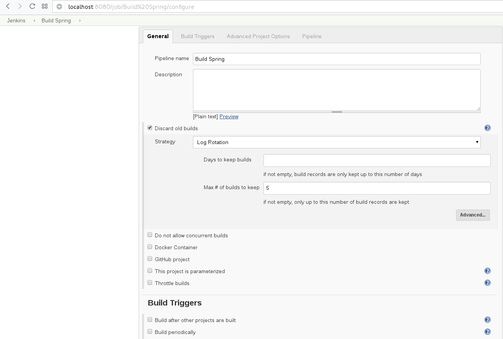
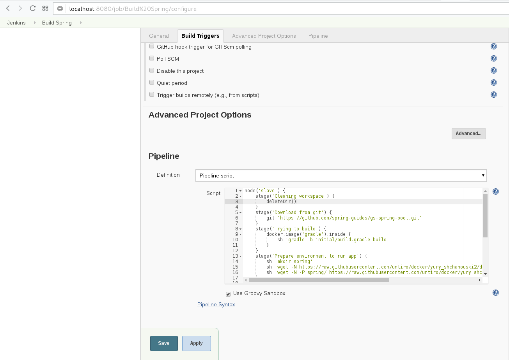
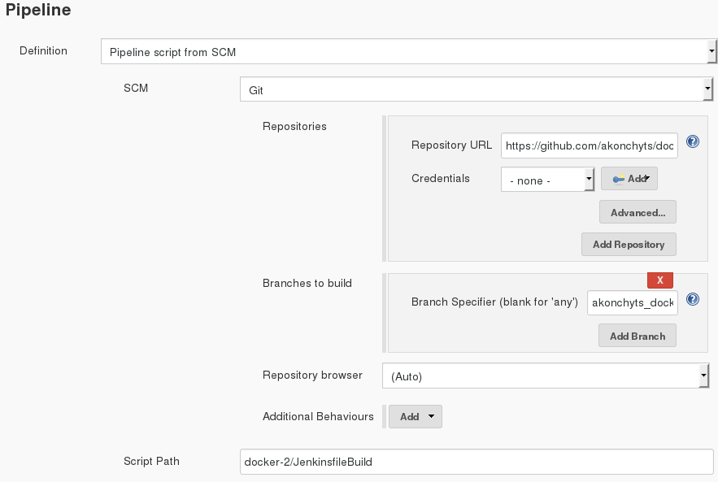
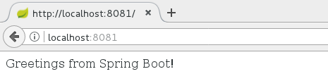

# Task:
1. Create custom ansible (v2.2.1) image ([ansible.Dockerfile](resources/ansible/ansible.Dockerfile))
#### Build command:

```
# command should be run from docker-2 directory 
$ docker build -t ansible -f resources/ansible/ansible.Dockerfile resources/ansible/.
```
2. Launch Jenkins from [official image](https://hub.docker.com/_/jenkins/)

``` 
$ docker pull jenkins/jenkins:lst 
$ docker run -d --rm --name myjenkins -p 8080:8080 -p 50000:50000 -v /home/data/jenkins:/var/jenkins_home jenkins
```
3. Link Docker Host as Jenknis slave (ssh)



4. Create custom gradle image ([gradle.Dockerfile](resources/gradle/gradle.Dockerfile))
#### Build command:

```
# command should be run from docker-2 directory 
$ docker build -t gradle -f resources/gradle/gradle.Dockerfile resources/gradle/.
```

5. Configure a job to build ([spring-boot application](https://spring.io/guides/gs/spring-boot/)) using gradle image buit in 3
#### Results:



6. Configure a job to run just built Spring Boot app with docker-compose 
([docker-compose.yml](resources/docker-compose.yml)) and
([spring.Dockerfile](resources/spring/spring.Dockerfile))



#### Jenkinsfile script: ([Jenkinsfile](resources/Jenkinsfile))


### Example of usage docker to isolate toolset with its dependencies:

```
# what version?
$ docker run --rm sbeliakou/ansible:2.2.1 ansible --version

# run playbook from current dir
$ alias ansible-playbook='docker run --rm -v $(pwd):$(pwd) -w $(pwd) sbeliakou/ansible:2.2.1 ansible-playbook -vv'
$ ansible-playbook playbook.yml
```

### Using Docker in Jenkinsfile
[Jenkins Docker Pipeline plugin](https://go.cloudbees.com/docs/cloudbees-documentation/cje-user-guide/index.html#docker-workflow)

```
  stage('Run Tests') {
    try {
      dir('webapp') {
        sh "mvn test"
        docker.build("sbeliakou/my_container:${env.BUILD_NUMBER}").push()
      }
    } catch (error) {

    } finally {
      junit '**/target/surefire-reports/*.xml'
    }
  }
```

### Dockerized Zabbix
[Solution](https://www.zabbix.org/wiki/Dockerized_Zabbix)
