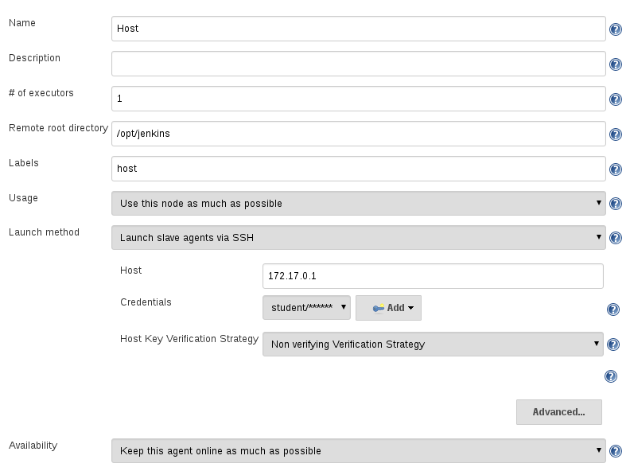
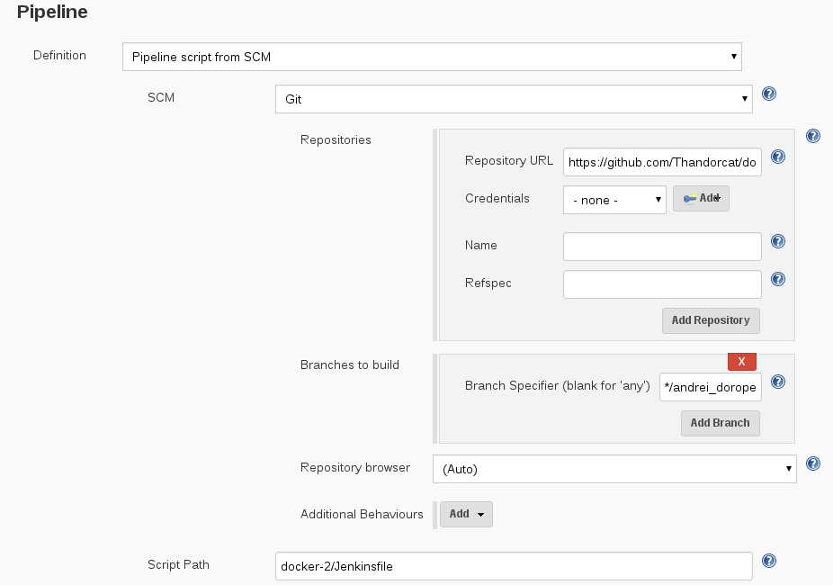

# Task:
1. Create custom ansible (v2.2.1) image
2. Launch Jenkins from [official image](https://hub.docker.com/_/jenkins/)
3. Link Docker Host as Jenknis slave (ssh)



4. Create custom gradle image 

[gradle.Dockerfile:](gradle.Dockerfile)

```
FROM sbeliakou/centos:7.2
MAINTAINER Andrei Doropei (andrei_doropei@epam.com)
RUN yum -y update; yum -y install epel-release; yum -y install java-devel wget unzip
RUN wget https://services.gradle.org/distributions/gradle-3.4.1-bin.zip && \
    mkdir /opt/gradle && \
    unzip -d /opt/gradle gradle-3.4.1-bin.zip
ENV PATH=$PATH:/opt/gradle/gradle-3.4.1/bin
ENV JAVA_HOME=/usr/lib/jvm/jre
ENV GRADLE_HOME=/opt/gradle
CMD gradle -v

```
5. Configure a job to build [spring-boot application](https://spring.io/guides/gs/spring-boot/) using gradle image buit in 3



[Jenkinsfile:](Jenkinsfile)

```
node('host') {

  stage('Check out code') {
      git branch: 'andrei_doropei2', url: 'https://github.com/Thandorcat/docker.git'
  }

  stage ('Build gradle container'){
	   docker.build ('gradle', '-f docker-2/gradle.Dockerfile .')
  }

  dir('docker-2'){
    stage ('Build code'){
        docker.image('gradle:latest').inside {
             sh 'gradle -b initial/build.gradle build' 
    	  }
	  }
  	stage ('Deployment'){
        sh 'docker-compose up -d'
    }
	}
 }
```


6. Configure a job to run just built Spring Boot app with docker-compose


[docker-compose.yml:](docker-compose.yml)

```
ersion: '2'
services:
 jar:
  build:
    context: .
    dockerfile: app.Dockerfile
  volumes:
  - ./initial/build/libs/:/opt/
  ports: 
  - 8081:8080
```

[app.Dockerfile:](app.Dockerfile)

```
FROM sbeliakou/centos:7.2
MAINTAINER Andrei Doropei (andrei_doropei@epam.com)
RUN yum -y update; yum -y install epel-release; yum -y install java-devel
CMD java -jar /opt/gs-spring-boot-0.1.0.jar
```


### Example of usage docker to isolate toolset with its dependencies:

```
# what version?
$ docker run --rm sbeliakou/ansible:2.2.1 ansible --version

# run playbook from current dir
$ alias ansible-playbook='docker run --rm -v $(pwd):$(pwd) -w $(pwd) sbeliakou/ansible:2.2.1 ansible-playbook -vv'
$ ansible-playbook playbook.yml
```

### Using Docker in Jenkinsfile
[Jenkins Docker Pipeline plugin](https://go.cloudbees.com/docs/cloudbees-documentation/cje-user-guide/index.html#docker-workflow)

```
  stage('Run Tests') {
    try {
      dir('webapp') {
        sh "mvn test"
        docker.build("sbeliakou/my_container:${env.BUILD_NUMBER}").push()
      }
    } catch (error) {

    } finally {
      junit '**/target/surefire-reports/*.xml'
    }
  }
```

### Dockerized Zabbix
[Solution](https://www.zabbix.org/wiki/Dockerized_Zabbix)
