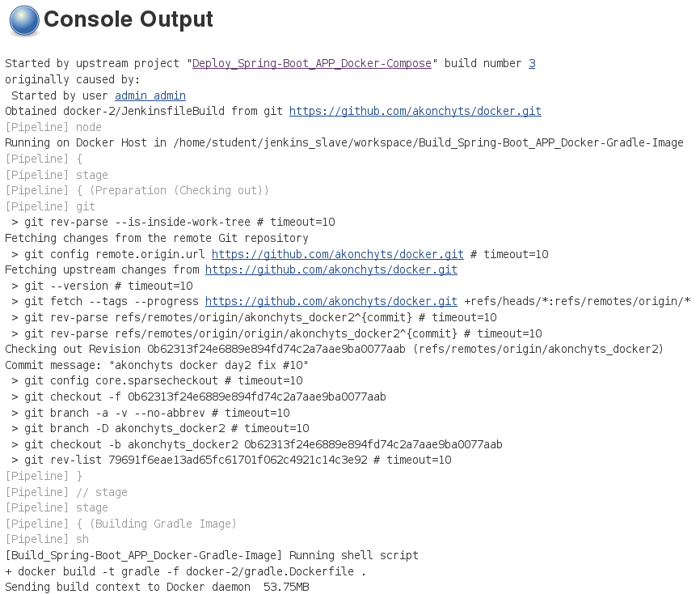
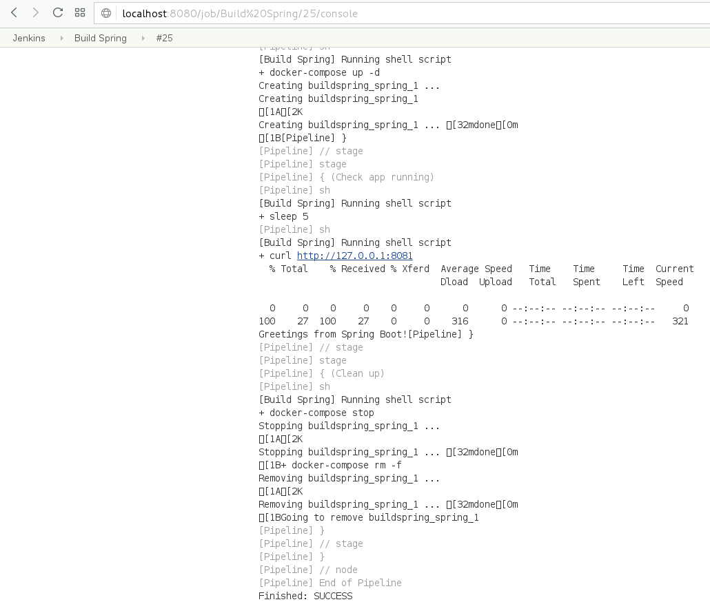

# Task:
1. Create custom ansible (v2.2.1) image
2. Launch Jenkins from [official image](https://hub.docker.com/_/jenkins/)
3. Link Docker Host as Jenknis slave (ssh)
4. Create custom gradle image
5. Configure a job to build [spring-boot application](https://spring.io/guides/gs/spring-boot/) using gradle image buit in 3
6. Configure a job to run just built Spring Boot app with docker-compose


### Example of usage docker to isolate toolset with its dependencies:

```
# what version?
$ docker run --rm sbeliakou/ansible:2.2.1 ansible --version

# run playbook from current dir
$ alias ansible-playbook='docker run --rm -v $(pwd):$(pwd) -w $(pwd) sbeliakou/ansible:2.2.1 ansible-playbook -vv'
$ ansible-playbook playbook.yml
```

### Using Docker in Jenkinsfile
[Jenkins Docker Pipeline plugin](https://go.cloudbees.com/docs/cloudbees-documentation/cje-user-guide/index.html#docker-workflow)

```
  stage('Run Tests') {
    try {
      dir('webapp') {
        sh "mvn test"
        docker.build("sbeliakou/my_container:${env.BUILD_NUMBER}").push()
      }
    } catch (error) {

    } finally {
      junit '**/target/surefire-reports/*.xml'
    }
  }
```

### Dockerized Zabbix
[Solution](https://www.zabbix.org/wiki/Dockerized_Zabbix)


Task Report Notes
---
### **1.** Launch Jenkins from [official image](https://hub.docker.com/_/jenkins/):  
   *$ docker run --name myjenkins -p 8080:8080 -p 50000:50000 -d -v /home/student/jenkins_home:/var/jenkins_home jenkins*   
	  
  
    
  
### **2.** Link Docker Host as Jenknis slave (ssh):  
   * Add Docker Host as node slave in Jinkins:  
     
  
    
  
### **3.** Create custom gradle image:  
   * Create custom gradle image (see [gradle.Dockerfile](gradle.Dockerfile)):  
	   
   
### **4.** Configure a job to build [spring-boot application](https://spring.io/guides/gs/spring-boot/) using gradle image buit on previous step:  
   * Create pipeline job "Build_Spring-Boot_APP_Docker-Gradle-Image" as downstream job to just build an application (see [JenkinsfileBuild](JenkinsfileBuild)):  
	   
    
### **5.** Configure a job to run just built Spring Boot app with docker-compose:  
   * Create pipeline job "Deploy_Spring-Boot_APP_Docker-Compose" as upstream job to run the downstream job "Build_Spring-Boot_APP_Docker-Gradle-Image" to fetch the artifact to deploy it and check it (see [JenkinsfileDeploy](JenkinsfileDeploy)):  
	   

   * See the result of the upstream job:
	   
   
     
   
     
   
   * See the result of the downstream job:
	   
   
     
   
     
   
     
   
   * See the result of deployment:
     
